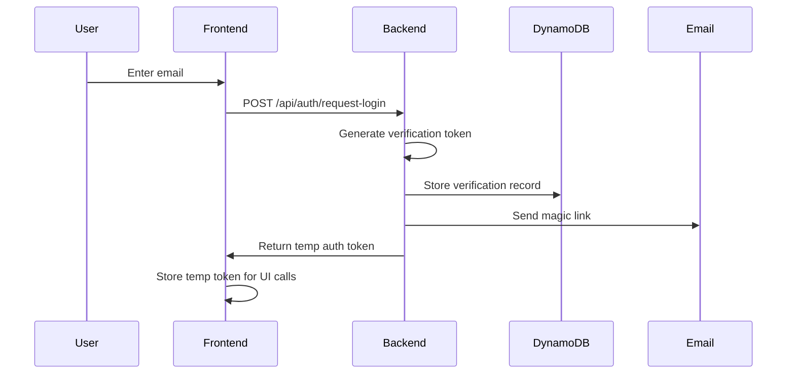
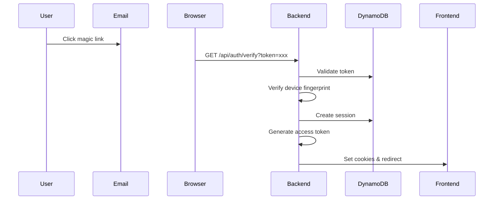

# Customer Identity and Access Management (CIAM)

## Overview

This document outlines the Customer Identity and Access Management system for the `nextjs-dharma-connect` monorepo. All applications within this monorepo share this unified CIAM implementation, providing secure, scalable authentication and authorization.

## Architecture

### Core Components

1. **Email Authentication** - Magic link based authentication with verification tokens
2. **Session Management** - DynamoDB-backed sessions with 30-day expiration
3. **Access Tokens** - Short-lived JWT tokens (15 minutes) with embedded claims
4. **CSRF/CORS Protection** - All routes protected against cross-site attacks
5. **Device Fingerprinting** - Additional security layer for device verification

### Technology Stack

- **Backend**: Next.js API Routes
- **Database**: DynamoDB (TTL-enabled tables)
- **Tokens**: JWT (access tokens only, no refresh tokens)
- **Email**: AWS SES/gmail or similar provider
- **Security**: httpOnly cookies, CSRF tokens, device fingerprinting

## Authentication Flow

### 1. Login Request



**Verification Record Structure**:
```javascript
{
  token: "a7b9c3d5e7f9...",          // Unique verification token
  email: "user@example.com",
  userId: "user-123",                 // null for new signups
  deviceFingerprint: "abc123...",
  requestContext: {
    ipAddress: "192.168.1.1",
    userAgent: "Mozilla/5.0...",
    timestamp: 1704067200000
  },
  postVerificationAction: {
    type: "create_session",
    redirectUrl: "/dashboard"
  },
  createdAt: 1704067200000,
  expiresAt: 1704068100000,          // 15 minutes TTL
  used: false,
  attempts: 0
}
```

### 2. Temporary Auth During Verification

During the auth flow, users receive a temporary JWT token with limited claims:

```javascript
// Temporary auth token payload
{
  email: "user@example.com",
  purpose: "auth-flow-ui",
  permissions: ["read:translations", "read:public-config"],
  deviceFingerprint: "abc123...",
  validUntil: 1704069000000  // 30 minutes
}
```

This token allows access to auth-flow routes only.

### 3. Email Verification



### 4. Session Creation

Upon successful verification:

```javascript
// Session structure in DynamoDB
{
  sessionId: "550e8400-e29b-41d4-a716-446655440000",
  userId: "user-123",
  email: "user@example.com",
  
  // Claims embedded in session
  claims: {
    // Identity claims
    identity: {
      email: "user@example.com",
      emailVerified: true
    },
    
    // Authorization claims
    authorization: {
      role: "user",
      permissions: ["read", "write"],
      organizationId: "org-456",
      subscription: "premium"
    },
    
    // Dynamic claims (updated periodically)
    limits: {
      apiCallsRemaining: 950,
      storageUsedMB: 234
    }
  },
  
  deviceFingerprint: "abc123...",
  verificationTokenUsed: "a7b9c3d5e7f9...",  // Audit trail
  createdAt: 1704067200000,
  expiresAt: 1706659200000,                   // 30 days
  lastUsed: 1704067200000,
  lastClaimsRefresh: 1704067200000
}
```

## Token Management

### Access Tokens (JWT)

Short-lived tokens (15 minutes) containing essential claims:

```javascript
// Access token payload
{
  userId: "user-123",
  email: "user@example.com",
  role: "user",
  permissions: ["read", "write"],
  organizationId: "org-456",
  iat: 1704067200,
  exp: 1704068100  // 15 minutes
}
```

### No Refresh Tokens

This implementation uses **session IDs instead of refresh tokens**. The session ID in the cookie acts as the refresh mechanism:

1. Access token expires every 15 minutes
2. Session ID cookie (30 days) is used to generate new access tokens
3. Claims are refreshed from the database during token renewal

### Cookie Configuration

```javascript
// Access token cookie
{
  name: "accessToken",
  value: "eyJhbGciOiJ...",
  httpOnly: true,
  secure: true,
  sameSite: "strict",
  maxAge: 900  // 15 minutes
}

// Session ID cookie
{
  name: "sessionId",
  value: "550e8400-e29b-41d4-a716-446655440000",
  httpOnly: true,
  secure: true,
  sameSite: "strict",
  maxAge: 2592000  // 30 days
}
```

## Route Categories

### 1. Public Routes
No authentication required:
- `/api/health`
- `/api/status`
- `/api/config/public`

### 2. Auth Flow Routes
Available during authentication process with temp token:
- `/api/auth/request-login`
- `/api/auth/verify`
- `/api/auth/resend`
- `/api/translations`
- `/api/config/ui`

### 3. Protected Routes
Require valid session and access token:
- `/api/user/*`
- `/api/data/*`
- `/api/admin/*` (additional role check)

### Route Protection Example

```javascript
// middleware/auth.js
export async function withAuth(handler, options = {}) {
  return async (req, res) => {
    const { routeType = 'protected' } = options;
    
    // Public routes - no auth needed
    if (routeType === 'public') {
      return handler(req, res);
    }
    
    // Auth flow routes - allow temp token
    if (routeType === 'auth-flow') {
      const tempToken = req.headers['x-temp-auth'];
      if (tempToken) {
        try {
          const decoded = jwt.verify(tempToken, process.env.TEMP_TOKEN_SECRET);
          if (decoded.purpose === 'auth-flow-ui' && decoded.validUntil > Date.now()) {
            req.tempAuth = decoded;
            return handler(req, res);
          }
        } catch (error) {
          // Continue to check for full auth
        }
      }
    }
    
    // Protected routes - require full auth
    const { accessToken, sessionId } = parseCookies(req);
    
    try {
      // Verify access token
      const decoded = jwt.verify(accessToken, process.env.JWT_SECRET);
      req.user = decoded;
      return handler(req, res);
    } catch (error) {
      // Access token expired, try to refresh
      if (sessionId) {
        const newAuth = await refreshAccessToken(req, res, sessionId);
        if (newAuth) {
          req.user = newAuth.user;
          return handler(req, res);
        }
      }
    }
    
    return res.status(401).json({ error: 'Unauthorized' });
  };
}
```

## Security Features

### CSRF Protection

All state-changing requests require CSRF token validation:

```javascript
// CSRF token generation
const csrfToken = crypto.randomBytes(32).toString('hex');

// Store in session
session.csrfToken = csrfToken;

// Validate on requests
if (req.method !== 'GET' && req.headers['x-csrf-token'] !== session.csrfToken) {
  return res.status(403).json({ error: 'Invalid CSRF token' });
}
```

### CORS Configuration

```javascript
// next.config.js
module.exports = {
  async headers() {
    return [
      {
        source: '/api/:path*',
        headers: [
          { key: 'Access-Control-Allow-Credentials', value: 'true' },
          { key: 'Access-Control-Allow-Origin', value: process.env.FRONTEND_URL },
          { key: 'Access-Control-Allow-Methods', value: 'GET,POST,PUT,DELETE,OPTIONS' },
          { key: 'Access-Control-Allow-Headers', value: 'X-CSRF-Token, X-Temp-Auth, X-Device-Fingerprint' }
        ]
      }
    ];
  }
};
```

### Device Fingerprinting

```javascript
// Client-side fingerprint generation
async function getDeviceFingerprint() {
  const fp = await FingerprintJS.load();
  const result = await fp.get();
  return result.visitorId;
}

// Include in all auth requests
headers: {
  'X-Device-Fingerprint': await getDeviceFingerprint()
}
```

## Dynamic Claims Updates

Claims can be updated without requiring re-authentication:

```javascript
// Update user permissions
await dynamodb.update({
  TableName: 'Sessions',
  Key: { sessionId },
  UpdateExpression: 'SET claims.authorization.role = :role, claims.authorization.permissions = :perms',
  ExpressionAttributeValues: {
    ':role': 'admin',
    ':perms': ['read', 'write', 'delete', 'admin']
  }
});

// Next token refresh will include updated claims
```

## DynamoDB Tables

### VerificationTokens Table

```yaml
TableName: VerificationTokens
PartitionKey: token (String)
TTL: expiresAt
Attributes:
  - token: String
  - email: String
  - userId: String (optional)
  - deviceFingerprint: String
  - requestContext: Map
  - postVerificationAction: Map
  - createdAt: Number
  - expiresAt: Number (TTL)
  - used: Boolean
  - attempts: Number
```

### Sessions Table

```yaml
TableName: Sessions
PartitionKey: sessionId (String)
TTL: expiresAt
GlobalSecondaryIndex: 
  - Name: UserIdIndex
    PartitionKey: userId
Attributes:
  - sessionId: String
  - userId: String
  - email: String
  - claims: Map
  - deviceFingerprint: String
  - verificationTokenUsed: String
  - createdAt: Number
  - expiresAt: Number (TTL)
  - lastUsed: Number
  - lastClaimsRefresh: Number
```

## Implementation Checklist

- [ ] Set up DynamoDB tables with TTL enabled
- [ ] Configure environment variables
- [ ] Implement device fingerprinting
- [ ] Create auth API routes
- [ ] Set up email provider
- [ ] Implement route middleware
- [ ] Add CSRF protection
- [ ] Configure CORS headers
- [ ] Create frontend auth client
- [ ] Add session management utilities
- [ ] Implement claims refresh logic
- [ ] Set up monitoring and alerts
- [ ] Create audit logging
- [ ] Document API endpoints
- [ ] Add rate limiting

## Environment Variables

```env
# JWT Secrets
JWT_SECRET=your-jwt-secret
TEMP_TOKEN_SECRET=your-temp-token-secret

# AWS
AWS_REGION=us-east-1
AWS_ACCESS_KEY_ID=your-access-key
AWS_SECRET_ACCESS_KEY=your-secret-key

# DynamoDB Tables
VERIFICATION_TOKENS_TABLE=nextjs-dharma-verification-tokens
SESSIONS_TABLE=nextjs-dharma-sessions

# Frontend URL (for CORS)
FRONTEND_URL=https://app.example.com

# Email
EMAIL_FROM=noreply@example.com
```

## Monitoring and Observability

### Key Metrics
- Login attempt rate
- Verification success rate
- Session creation rate
- Token refresh rate
- Failed authentication attempts
- Device fingerprint mismatches

### Audit Events
- Login requested
- Verification attempted
- Session created
- Claims updated
- Session revoked
- Suspicious activity detected

## Migration Guide

For applications migrating to this CIAM system:

1. Map existing user identifiers to new userId format
2. Implement device fingerprinting on all clients
3. Update API routes to use new middleware
4. Migrate from existing auth to magic links
5. Update frontend to handle temp tokens during auth
6. Test all protected routes with new auth flow

## Support

For questions or issues with the CIAM implementation:
- Check the troubleshooting guide in `/docs/ciam-troubleshooting.md`
- Review example implementations in `/examples/ciam-integration`
- Contact the platform team at info@extropicsystems.com