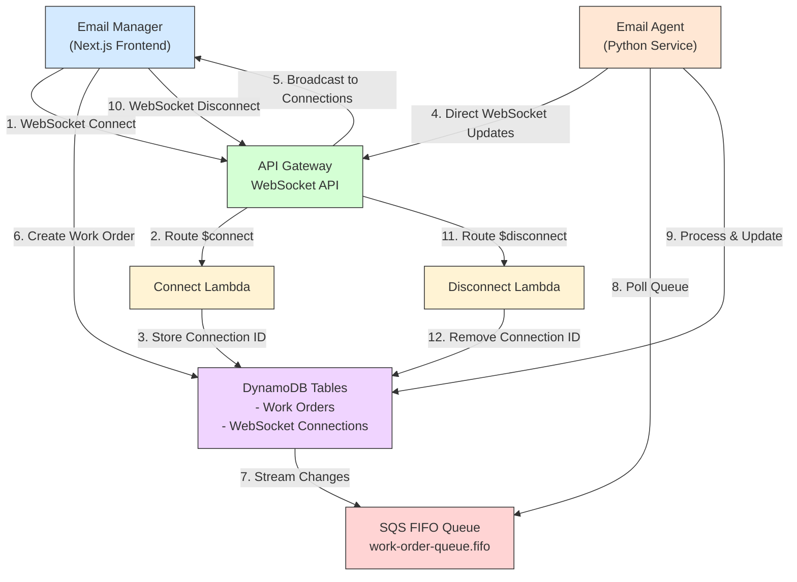

# Email Agent

A Python-based email processing agent that handles work orders through email communication.

## Setup

1. Create a `.env` file in the `apps/email-agent` directory with the following variables:

```env
# Email Configuration
EMAIL_HOST=smtp.gmail.com
EMAIL_PORT=587
# Note: Email credentials are currently stubbed and will be fetched from DynamoDB
# based on the work order's email account in a future update
EMAIL_FROM=noreply@example.com

# AWS Configuration
AWS_REGION=us-east-1
AWS_PROFILE=your-aws-profile-name  # e.g., 'default' or 'production'

# DynamoDB Configuration
DYNAMODB_TABLE=email-work-orders
WORK_ORDERS_TABLE=your-work-orders-table-name
CONNECTIONS_TABLE=your-connections-table-name

# SQS Configuration
SQS_QUEUE_URL=your-sqs-queue-url

# WebSocket Configuration
WEBSOCKET_API_URL=your-websocket-api-url  # e.g., wss://api-id.execute-api.region.amazonaws.com/stage

# S3 Configuration
S3_BUCKET=your-s3-bucket-name  # e.g., your-email-templates-bucket

# Mailchimp Configuration
MAILCHIMP_API_KEY=your-mailchimp-api-key  
MAILCHIMP_AUDIENCE=your-audience-name     
MAILCHIMP_REPLY_TO=example@example.com  # Reply-to email address for Mailchimp templates
MAILCHIMP_SERVER_PREFIX=us18  # The server prefix for your Mailchimp account (e.g., us18)

# Logging Configuration
LOG_LEVEL=INFO

# Email Templates Configuration
TEMPLATES_DIR=src/templates
```

2. Configure AWS credentials:
   - Ensure you have AWS credentials configured in `~/.aws/credentials`
   - The profile specified in `AWS_PROFILE` must exist and have valid credentials
   - Example AWS credentials file:
     ```ini
     [default]
     aws_access_key_id = YOUR_ACCESS_KEY
     aws_secret_access_key = YOUR_SECRET_KEY
     ```

3. Install dependencies:
```bash
pip install -r requirements.txt
```

4. Run the agent:
```bash
python src/main.py
```

## Setting up a New EC2 Instance

This guide provides step-by-step instructions for setting up the email-agent on a fresh Amazon Linux 2023 EC2 instance.

### Prerequisites

- A running Amazon Linux 2023 EC2 instance
- Appropriate IAM role attached to the instance (recommended) or AWS credentials configured
- Security groups configured to allow outbound HTTPS traffic

### Step 1: Update the system and install basic tools

```bash
# Update the system
sudo dnf update -y

# Install essential development tools
sudo dnf groupinstall "Development Tools" -y

# Install Python 3.9+ (should already be installed on AL2023)
sudo dnf install python3 python3-pip python3-devel -y

# Install git
sudo dnf install git -y

# Install other useful tools
sudo dnf install wget curl unzip -y
```

### Step 2: Verify Python version

```bash
python3 --version
pip3 --version
```

You should see Python 3.9 or higher, which supports the latest boto3 versions.

### Step 3: Clone the repository

```bash
# Clone the repository
git clone https://github.com/your-username/nextjs-dharma-connect.git
cd nextjs-dharma-connect/apps/email-agent
```

### Step 4: Install Python dependencies

```bash
# Upgrade pip to the latest version
pip3 install --upgrade pip

# Install the requirements
pip3 install -r requirements.txt
```

### Step 5: Set up AWS credentials and configuration

#### Option A: Using IAM Role (Recommended)
If your EC2 instance has an IAM role attached, no additional configuration is needed. The AWS SDK will automatically use the instance metadata service.

#### Option B: Manual AWS Configuration
```bash
# Install AWS CLI
sudo dnf install aws-cli -y

# Configure AWS credentials
aws configure
```

### Step 6: Set up environment variables

```bash
# Create a .env file
cp .env.example .env  # if there's an example file
# or create one manually
```

Configure the following environment variables in your `.env` file:

```env
# AWS Configuration
AWS_REGION=us-east-1  # or your preferred region
AWS_ACCESS_KEY_ID=your_access_key  # only if not using IAM role
AWS_SECRET_ACCESS_KEY=your_secret_key  # only if not using IAM role

# DynamoDB Tables
DYNAMODB_TABLE_WORK_ORDERS=WorkOrders
DYNAMODB_TABLE_PARTICIPANTS=Participants
DYNAMODB_TABLE_CONFIG=Config

# SQS Configuration
SQS_QUEUE_URL=https://sqs.us-east-1.amazonaws.com/your-account-id/email-agent-queue

# WebSocket Configuration
WEBSOCKET_ENDPOINT=wss://your-websocket-endpoint.amazonaws.com

# Other configurations as needed
```

### Step 7: Test the installation

```bash
# Test that the email-agent can be imported
python3 -c "import src.main; print('Email agent imports successfully')"

# Or run a simple test
python3 -m src.main --help
```

### Step 8: Set up as a service (Optional)

To run the email-agent as a system service:

```bash
# Create a systemd service file
sudo tee /etc/systemd/system/email-agent.service << EOF
[Unit]
Description=Email Agent Service
After=network.target

[Service]
Type=simple
User=ec2-user
WorkingDirectory=/home/ec2-user/nextjs-dharma-connect/apps/email-agent
Environment=PATH=/home/ec2-user/.local/bin:/usr/local/bin:/usr/bin:/bin
ExecStart=/usr/bin/python3 -m src.main
Restart=always
RestartSec=10

[Install]
WantedBy=multi-user.target
EOF

# Enable and start the service
sudo systemctl daemon-reload
sudo systemctl enable email-agent
sudo systemctl start email-agent

# Check status
sudo systemctl status email-agent
```

### Step 9: Set up logging (Optional)

```bash
# Create log directory
sudo mkdir -p /var/log/email-agent
sudo chown ec2-user:ec2-user /var/log/email-agent

# Update the service file to include logging
sudo tee /etc/systemd/system/email-agent.service << EOF
[Unit]
Description=Email Agent Service
After=network.target

[Service]
Type=simple
User=ec2-user
WorkingDirectory=/home/ec2-user/nextjs-dharma-connect/apps/email-agent
Environment=PATH=/home/ec2-user/.local/bin:/usr/local/bin:/usr/bin:/bin
ExecStart=/usr/bin/python3 -m src.main
Restart=always
RestartSec=10
StandardOutput=append:/var/log/email-agent/email-agent.log
StandardError=append:/var/log/email-agent/email-agent.log

[Install]
WantedBy=multi-user.target
EOF

# Reload and restart
sudo systemctl daemon-reload
sudo systemctl restart email-agent
```

### Step 10: Monitor the service

```bash
# View logs
tail -f /var/log/email-agent/email-agent.log

# Check service status
sudo systemctl status email-agent

# View recent logs
journalctl -u email-agent -f
```

### Troubleshooting

If you encounter any issues:

1. **Check Python version**: Make sure you have Python 3.8+
   ```bash
   python3 --version
   ```

2. **Check AWS credentials**: Verify your AWS configuration
   ```bash
   aws sts get-caller-identity
   ```

3. **Check environment variables**: Ensure all required env vars are set
   ```bash
   cat .env
   ```

4. **Check permissions**: Make sure the ec2-user has proper permissions
   ```bash
   ls -la /home/ec2-user/nextjs-dharma-connect/apps/email-agent
   ```

5. **Check network**: Ensure the instance can reach AWS services
   ```bash
   curl -I https://sqs.us-east-1.amazonaws.com
   ```

### Quick verification

```bash
# Check if everything is working
python3 -c "
import boto3
import pydantic
import websockets
import requests
import os
print('All dependencies installed successfully')
print(f'boto3 version: {boto3.__version__}')
print(f'Python version: {os.sys.version}')
"
```

### Security Considerations

- Use IAM roles instead of access keys when possible
- Ensure the EC2 instance has minimal required permissions
- Keep the system updated regularly
- Monitor logs for any suspicious activity
- Use security groups to restrict network access

## Required Environment Variables

The following environment variables are required:

- `AWS_PROFILE`: Name of the AWS profile to use for credentials
- `SQS_QUEUE_URL`: URL of the SQS queue for work orders
- `WEBSOCKET_API_URL`: URL of the WebSocket API for real-time updates
- `WORK_ORDERS_TABLE`: Name of the DynamoDB table for work orders
- `CONNECTIONS_TABLE`: Name of the DynamoDB table for WebSocket connections
- `S3_BUCKET`: Name of the S3 bucket for storing email templates
- `MAILCHIMP_API_KEY`: Your Mailchimp API key
- `MAILCHIMP_AUDIENCE`: The name of your Mailchimp audience/list
- `MAILCHIMP_REPLY_TO`: Reply-to email address for Mailchimp templates
- `MAILCHIMP_SERVER_PREFIX`: The server prefix for your Mailchimp account

Optional environment variables with defaults:

- `EMAIL_HOST`: SMTP host (default: smtp.gmail.com)
- `EMAIL_PORT`: SMTP port (default: 587)
- `EMAIL_FROM`: From email address (default: noreply@example.com)
- `AWS_REGION`: AWS region (default: us-east-1)
- `DYNAMODB_TABLE`: DynamoDB table name (default: email-work-orders)
- `LOG_LEVEL`: Logging level (default: INFO)
- `TEMPLATES_DIR`: Directory containing email templates (default: src/templates)

Note: Email credentials (username and password) are currently stubbed with default values. In a future update, these will be fetched from DynamoDB based on the work order's email account.

## Features

- Email-based work order processing
- Integration with AWS DynamoDB for work order storage
- Integration with AWS SQS for work order queue management
- Real-time updates via WebSocket API
- Support for multiple email templates
- Configurable logging
- Support for both in-person and virtual events
- Optimistic UI updates for immediate user feedback

## Architecture

The email agent is part of a real-time communication system using WebSockets and SQS for work order processing:



### Communication Flow:

1. **WebSocket Setup**:
   - Email Manager connects to WebSocket API
   - Connection ID is stored in DynamoDB

2. **Real-time Updates**:
   - Email Agent sends updates directly through API Gateway Management API
   - Updates are broadcast to all active connections
   - No intermediate Lambda function required for updates

3. **Work Order Processing**:
   - Work orders are created in DynamoDB
   - Changes stream to SQS queue
   - Email Agent processes work orders
   - Real-time updates sent via WebSocket

4. **Connection Cleanup**:
   - Disconnections are handled automatically
   - Connection IDs are removed from DynamoDB

### Event Types Support

The system supports both virtual and in-person events:

- **Virtual Events**: Require Zoom ID for registration confirmation
- **In-Person Events**: Skip Zoom ID validation and show "In-Person" indicator
- **Event Configuration**: Each work order includes an `inPerson` boolean flag
- **UI Adaptation**: Frontend automatically adjusts fields based on event type

### Optimistic Updates

The frontend provides immediate user feedback through optimistic updates:

- **Start/Restart Actions**: UI immediately shows "working" status
- **Status Preservation**: Optimistic updates are preserved against older WebSocket messages
- **Real-time Sync**: Email agent updates overwrite optimistic states with actual progress

## Development

To add new features or modify existing ones:

1. Create or modify step implementations in the `steps/` directory
2. Add or update email templates in the `templates/` directory
3. Update the configuration in `config.py` if needed
4. Test your changes locally using the `.env` file

## Infrastructure

The AWS infrastructure is defined using CDK. To deploy:

```bash
cd infrastructure
npm install
cdk deploy
```

This will create:
- DynamoDB table with stream enabled
- SQS FIFO queue
- Lambda function
- API Gateway WebSocket API
- Required IAM roles and policies

## Development

### Adding New Steps

1. Add the step type to the `StepProcessor` class
2. Implement the processing logic
3. Update the work order model if needed

### Testing

```bash
pytest
```

## Monitoring

The agent logs to CloudWatch Logs in production. Key metrics to monitor:
- SQS queue depth
- Lambda invocation errors
- WebSocket connection count
- Work order processing time 