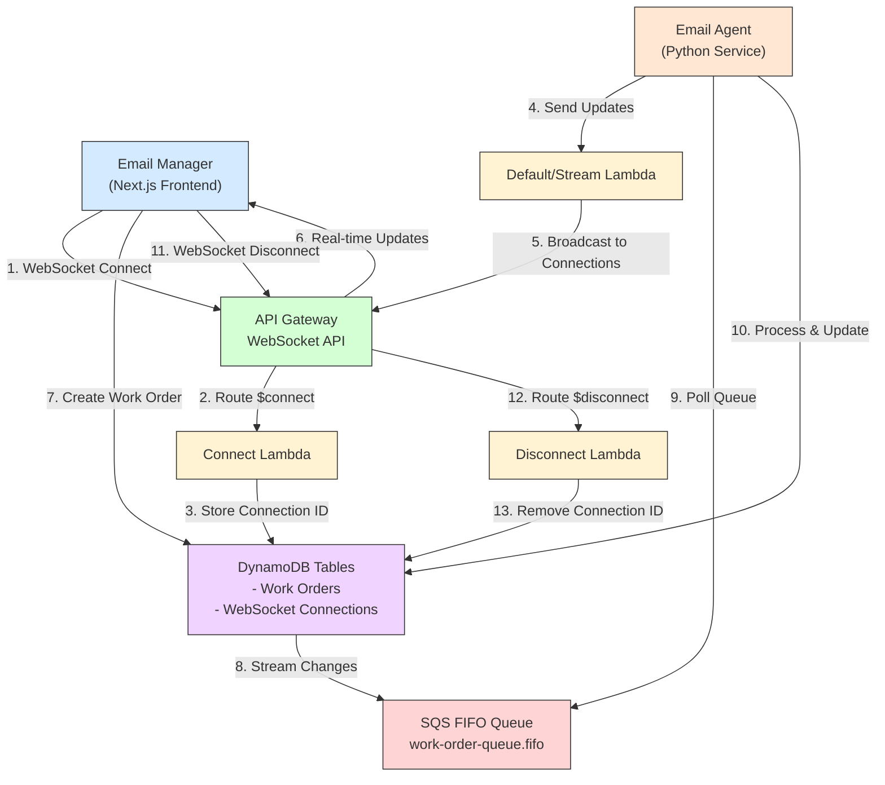

# Email Manager

A Next.js frontend application for managing email work orders with real-time updates.

## Architecture

The email manager is part of a real-time communication system using WebSockets and SQS for work order processing:

### Communication Flow:

1. **WebSocket Setup**:
   - Email Manager connects to WebSocket API
   - Connection ID is stored in DynamoDB

2. **Real-time Updates**:
   - Email Agent sends updates through Lambda
   - Updates are broadcast to all active connections

3. **Work Order Processing**:
   - Work orders are created in DynamoDB
   - Changes stream to SQS queue
   - Email Agent processes work orders
   - Real-time updates sent via WebSocket

4. **Connection Cleanup**:
   - Disconnections are handled automatically
   - Connection IDs are removed from DynamoDB 