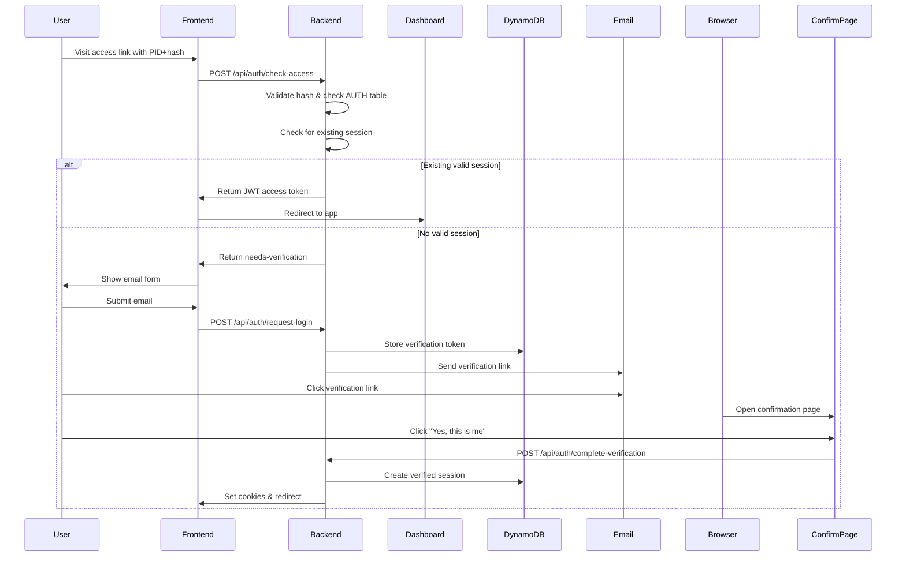

# Customer Identity and Access Management (CIAM)

## Overview

This document outlines the Customer Identity and Access Management system for the `nextjs-dharma-connect` monorepo. All applications within this monorepo share this unified CIAM implementation, providing secure, scalable authentication and authorization through a two-stage authentication process.

## Architecture

### Core Components

1. **Two-Stage Authentication**
   - Stage 1: High-entropy URL access validation (PID + hash)
   - Stage 2: Email verification with magic links
2. **Session Management** - DynamoDB-backed sessions with 30-day expiration
3. **Access Tokens** - Short-lived JWT tokens (15 minutes) with embedded claims
4. **CSRF/CORS Protection** - All routes protected against cross-site attacks
5. **Device Fingerprinting** - Additional security layer for device verification

### Technology Stack

- **Backend**: Next.js API Routes
- **Database**: DynamoDB (TTL-enabled tables)
- **Tokens**: JWT (access tokens only, no refresh tokens)
- **Email**: AWS SES or similar provider
- **Security**: httpOnly cookies, CSRF tokens, device fingerprinting

## Two-Stage Authentication Flow

### Stage 1: Link Validation

Users must first access the system through a personalized high-entropy link:

```
https://app.dharma-connect.com/access?pid=e271aea6-031e-4a7d-8269-99ee4adae5bf&hash=abc123...
```

This link is validated through `handleCheckAccess` which:
1. Verifies the hash using URL-specific secrets
2. Checks if the PID has access to the requested URL
3. Returns a JWT if an existing valid session is found
4. Creates a temporary session if email verification is needed

### Stage 2: Email Verification

If no valid session exists, users must verify their email:



### 1. Initial Access Check

The `handleCheckAccess` function validates the PID and hash, then either:
- Returns a JWT for existing valid sessions
- Creates a temporary session for new authentication attempts

**Request**:
```javascript
{
  pid: "e271aea6-031e-4a7d-8269-99ee4adae5bf",
  hash: "7f3a2b9c...",
  url: "https://app.dharma-connect.com",
  deviceFingerprint: "abc123..."
}
```

**Response (Authenticated)**:
```javascript
{
  status: "authenticated",
  accessToken: "eyJhbGciOiJ...",
  expiresIn: 900
}
```

**Response (Needs Verification)**:
```javascript
{
  status: "needs-verification",
  tempToken: "eyJhbGciOiJ...",
  email: "user@example.com"  // Pre-filled if available
}
```

### 2. Email Verification Request

Users must explicitly request email verification after link validation.

**Verification Token Structure**:
```javascript
{
  token: "7f8a9b2c3d4e5f6g7h8i9j0k1l2m3n4o",  // Crypto random
  pid: "e271aea6-031e-4a7d-8269-99ee4adae5bf",
  email: "user@example.com",
  deviceFingerprint: "abc123...",
  linkSessionId: "550e8400-...",
  
  requestContext: {
    ipAddress: "192.168.1.1",
    userAgent: "Mozilla/5.0...",
    timestamp: 1704067200000
  },
  
  postVerificationAction: {
    redirectTo: "/dashboard",
    createSessionFor: {
      pid: "e271aea6-...",
      email: "user@example.com"
    }
  },
  
  createdAt: 1704067200000,
  expiresAt: 1704068100000,  // 15 minutes TTL
  used: false,
  attempts: 0
}
```

### 3. Email Verification Confirmation

The verification email contains a link to a confirmation page:

```
https://app.dharma-connect.com/confirm?token=7f8a9b2c3d4e5f6g7h8i9j0k1l2m3n4o
```

Users must explicitly confirm their identity on this page before access is granted.

### 4. Session Creation

Upon successful verification:

```javascript
// Session structure in DynamoDB
{
  sessionId: "550e8400-e29b-41d4-a716-446655440000",
  userId: "user-123",
  email: "user@example.com",
  verified: false,  // Set to true after email verification
  
  // Hierarchical claims structure
  claims: {
    // Identity claims (who the user is)
    identity: {
      email: "user@example.com",
      emailVerified: true,
      name: "John Doe",
      locale: "en-US",
      timezone: "America/New_York"
    },
    
    // Authorization claims (what actions the user can perform)
    authorization: {
      role: "user",  // Used for broad categorization
      actions: [
        "handleFindParticipant",
        "handleScanTable", 
        "handleCheckAccess",
        "handleGetUserProfile",
        "handleUpdateProfile",
        "handleListDocuments",
        "handleCreateDocument",
        "handleDeleteDocument"
      ],
      organizationId: "org-456",
      departments: ["engineering", "product"],
      subscription: "premium",
      // Action-specific constraints
      actionConstraints: {
        "handleScanTable": {
          maxResults: 100,
          allowedTables: ["participants", "documents"]
        },
        "handleCreateDocument": {
          maxSizeMB: 10,
          allowedTypes: ["pdf", "docx"]
        }
      }
    },
    
    // Dynamic claims (computed/updated frequently)
    limits: {
      apiCallsRemaining: 950,
      apiCallsResetAt: 1704070800000,
      storageUsedMB: 234,
      maxStorageMB: 1000,
      activeProjects: 5,
      maxProjects: 10
    },
    
    // Session metadata
    metadata: {
      lastPasswordChange: 1703462400000,
      mfaEnabled: true,
      preferredMfaMethod: "totp"
    }
  },
  
  deviceFingerprint: "abc123...",
  verificationTokenUsed: "a7b9c3d5e7f9...",  // Audit trail
  createdAt: 1704067200000,
  expiresAt: 1706659200000,                   // 30 days
  lastUsed: 1704067200000,
  lastClaimsRefresh: 1704067200000
}
```

## Token Management

### Access Tokens (JWT)

Short-lived tokens (15 minutes) containing essential claims:

```javascript
// Access token payload
{
  userId: "user-123",
  email: "user@example.com",
  role: "user",
  actions: [
    "handleFindParticipant",
    "handleScanTable",
    "handleCheckAccess"
    // Only include frequently used actions in JWT
  ],
  organizationId: "org-456",
  iat: 1704067200,
  exp: 1704068100  // 15 minutes
}
```

### No Refresh Tokens

This implementation uses **session IDs instead of refresh tokens**. The session ID in the cookie acts as the refresh mechanism:

1. Access token expires every 15 minutes
2. Session ID cookie (30 days) is used to generate new access tokens
3. Claims are refreshed from the database during token renewal

### Cookie Configuration

```javascript
// Access token cookie
{
  name: "accessToken",
  value: "eyJhbGciOiJ...",
  httpOnly: true,
  secure: true,
  sameSite: "strict",
  maxAge: 900  // 15 minutes
}

// Session ID cookie
{
  name: "sessionId",
  value: "550e8400-e29b-41d4-a716-446655440000",
  httpOnly: true,
  secure: true,
  sameSite: "strict",
  maxAge: 2592000  // 30 days
}

// Temporary auth cookie (during auth flow)
{
  name: "tempAuthToken",
  value: "eyJhbGciOiJ...",
  httpOnly: true,
  secure: true,
  sameSite: "strict",
  maxAge: 1800  // 30 minutes
}
```

## Route Categories

### 1. Public Routes
No authentication required:
- `/api/health`
- `/api/status`
- `/api/config/public`

### 2. Auth Flow Routes
Available during authentication process with temp token:
- `/api/auth/request-login`
- `/api/auth/verify`
- `/api/auth/resend`
- `/api/translations`
- `/api/config/ui`

### 3. Protected Routes
Require valid session and access token:
- `/api/user/*`
- `/api/data/*`
- `/api/admin/*` (additional role check)

### Route Protection Example

```javascript
// middleware/auth.js
export async function withAuth(handler, options = {}) {
  return async (req, res) => {
    const { routeType = 'protected' } = options;
    
    // Public routes - no auth needed
    if (routeType === 'public') {
      return handler(req, res);
    }
    
    // Auth flow routes - allow temp token
    if (routeType === 'auth-flow') {
      const tempToken = req.cookies.tempAuthToken;
      if (tempToken) {
        try {
          const decoded = jwt.verify(tempToken, process.env.TEMP_TOKEN_SECRET);
          if (decoded.purpose === 'auth-flow-ui' && decoded.validUntil > Date.now()) {
            req.tempAuth = decoded;
            return handler(req, res);
          }
        } catch (error) {
          // Continue to check for full auth
        }
      }
    }
    
    // Protected routes - require full auth
    const { accessToken, sessionId } = parseCookies(req);
    
    try {
      // Verify access token
      const decoded = jwt.verify(accessToken, process.env.JWT_SECRET);
      req.user = decoded;
      return handler(req, res);
    } catch (error) {
      // Access token expired, try to refresh
      if (sessionId) {
        const newAuth = await refreshAccessToken(req, res, sessionId);
        if (newAuth) {
          req.user = newAuth.user;
          return handler(req, res);
        }
      }
    }
    
    return res.status(401).json({ error: 'Unauthorized' });
  };
}
```

## Security Features

### CSRF Protection

All state-changing requests require CSRF token validation:

```javascript
// CSRF token generation
const csrfToken = crypto.randomBytes(32).toString('hex');

// Store in session
session.csrfToken = csrfToken;

// Validate on requests
if (req.method !== 'GET' && req.headers['x-csrf-token'] !== session.csrfToken) {
  return res.status(403).json({ error: 'Invalid CSRF token' });
}
```

### CORS Configuration

```javascript
// next.config.js
module.exports = {
  async headers() {
    return [
      {
        source: '/api/:path*',
        headers: [
          { key: 'Access-Control-Allow-Credentials', value: 'true' },
          { key: 'Access-Control-Allow-Origin', value: process.env.FRONTEND_URL },
          { key: 'Access-Control-Allow-Methods', value: 'GET,POST,PUT,DELETE,OPTIONS' },
          { key: 'Access-Control-Allow-Headers', value: 'X-CSRF-Token, X-Temp-Auth, X-Device-Fingerprint' }
        ]
      }
    ];
  }
};
```

### Device Fingerprinting

```javascript
// Client-side fingerprint generation
async function getDeviceFingerprint() {
  const fp = await FingerprintJS.load();
  const result = await fp.get();
  return result.visitorId;
}

// Include in all auth requests
headers: {
  'X-Device-Fingerprint': await getDeviceFingerprint()
}
```

### Unverified vs Verified Sessions

Sessions start in an unverified state with limited claims:

```javascript
// Unverified session (during auth flow)
{
  sessionId: "550e8400-...",
  email: "user@example.com",
  verified: false,
  claims: {
    identity: {
      email: "user@example.com",
      emailVerified: false
    },
    authorization: {
      role: "guest",
      actions: [
        "handleGetTranslations",
        "handleGetPublicConfig",
        "handleRequestLogin",
        "handleVerifyEmail"
      ],
      organizationId: null
    },
    limits: {
      apiCallsRemaining: 10,  // Very limited
      maxStorageMB: 0
    }
  },
  expiresAt: Date.now() + 1800000  // 30 minutes for unverified
}

// After verification, session is updated
{
  verified: true,
  claims: {
    authorization: {
      role: "user",
      actions: [
        "handleFindParticipant",
        "handleScanTable",
        "handleCheckAccess",
        "handleGetUserProfile",
        "handleUpdateProfile",
        "handleListDocuments",
        "handleCreateDocument",
        // ... full list of allowed actions
      ],
      actionConstraints: {
        "handleScanTable": {
          maxResults: 100,
          allowedTables: ["participants", "documents"]
        }
      }
    },
    limits: {
      apiCallsRemaining: 1000,
      maxStorageMB: 1000
    }
  },
  expiresAt: Date.now() + 2592000000  // Extended to 30 days
}
```

```javascript
// Update user permissions after verification
await dynamodb.update({
  TableName: 'Sessions',
  Key: { sessionId },
  UpdateExpression: `
    SET verified = :true,
    claims.authorization.role = :role,
    claims.authorization.actions = :actions,
    claims.identity.emailVerified = :emailVerified
  `,
  ExpressionAttributeValues: {
    ':true': true,
    ':role': 'user',
    ':actions': [
      'handleFindParticipant',
      'handleScanTable',
      'handleCheckAccess',
      'handleGetUserProfile',
      'handleUpdateProfile'
    ],
    ':emailVerified': true
  }
});

// Update dynamic limits
await dynamodb.update({
  TableName: 'Sessions',
  Key: { sessionId },
  UpdateExpression: 'SET claims.limits = :limits, lastClaimsRefresh = :now',
  ExpressionAttributeValues: {
    ':limits': {
      apiCallsRemaining: 950,
      apiCallsResetAt: Date.now() + 3600000,
      storageUsedMB: 234,
      maxStorageMB: 1000
    },
    ':now': Date.now()
  }
});

// Next token refresh will include updated claims
```

## DynamoDB Tables

### VerificationTokens Table

```yaml
TableName: VerificationTokens
PartitionKey: token (String)
TTL: expiresAt
Attributes:
  - token: String
  - email: String
  - userId: String (optional)
  - deviceFingerprint: String
  - requestContext: Map
  - postVerificationAction: Map
  - createdAt: Number
  - expiresAt: Number (TTL)
  - used: Boolean
  - attempts: Number
```

### Sessions Table

```yaml
TableName: Sessions
PartitionKey: sessionId (String)
TTL: expiresAt
GlobalSecondaryIndex: 
  - Name: UserIdIndex
    PartitionKey: userId
Attributes:
  - sessionId: String
  - userId: String
  - email: String
  - verified: Boolean
  - claims: Map
    - identity: Map
    - authorization: Map
    - limits: Map
    - metadata: Map
  - deviceFingerprint: String
  - verificationTokenUsed: String
  - createdAt: Number
  - expiresAt: Number (TTL)
  - lastUsed: Number
  - lastClaimsRefresh: Number
```

## Implementation Checklist

- [ ] Set up DynamoDB tables with TTL enabled
- [ ] Configure environment variables
- [ ] Implement device fingerprinting
- [ ] Create auth API routes
- [ ] Set up email provider
- [ ] Implement route middleware
- [ ] Add CSRF protection
- [ ] Configure CORS headers
- [ ] Create frontend auth client
- [ ] Add session management utilities
- [ ] Implement claims refresh logic
- [ ] Set up monitoring and alerts
- [ ] Create audit logging
- [ ] Document API endpoints
- [ ] Add rate limiting

## Environment Variables

```env
# JWT Secrets
JWT_SECRET=your-jwt-secret
TEMP_TOKEN_SECRET=your-temp-token-secret

# AWS
AWS_REGION=us-east-1
AWS_ACCESS_KEY_ID=your-access-key
AWS_SECRET_ACCESS_KEY=your-secret-key

# DynamoDB Tables
VERIFICATION_TOKENS_TABLE=nextjs-dharma-verification-tokens
SESSIONS_TABLE=nextjs-dharma-sessions

# Frontend URL (for CORS)
FRONTEND_URL=https://app.example.com

# Email
EMAIL_FROM=noreply@example.com
```

## Monitoring and Observability

### Key Metrics
- Login attempt rate
- Verification success rate
- Session creation rate
- Token refresh rate
- Failed authentication attempts
- Device fingerprint mismatches

### Audit Events
- Login requested
- Verification attempted
- Session created
- Claims updated
- Session revoked
- Suspicious activity detected

## Migration Guide

For applications migrating to this CIAM system:

1. Map existing user identifiers to new userId format
2. Implement device fingerprinting on all clients
3. Update API routes to use new middleware
4. Migrate from existing auth to magic links
5. Update frontend to handle temp tokens during auth
6. Test all protected routes with new auth flow

## Support

For questions or issues with the CIAM implementation:
- Check the troubleshooting guide in `/docs/ciam-troubleshooting.md`
- Review example implementations in `/examples/ciam-integration`
- Contact the platform team at platform@dharma-connect.com