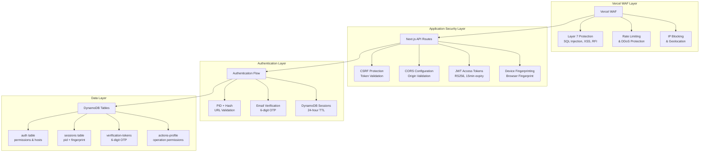
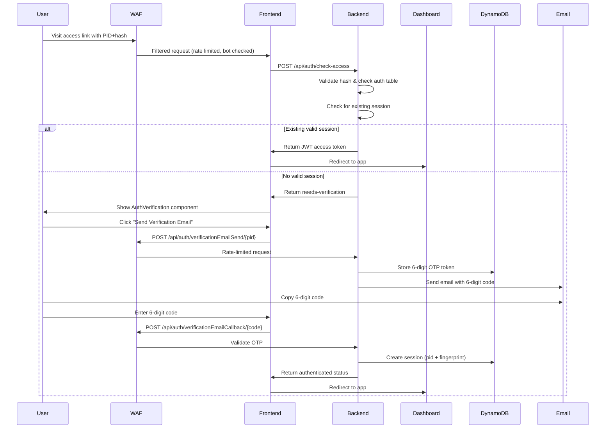

# Customer Identity and Access Management (CIAM)

## Overview

This document defines the authentication and session architecture for the nextjs-dharma-connect monorepo. It describes the two-stage auth flow (PID+hash → email verification), DynamoDB-backed session model, short-lived JWT access tokens (no refresh tokens), CSRF/CORS protections, route hardening, device fingerprinting, and how these pieces integrate with Vercel’s WAF. The goal is to give engineers and reviewers a single, handoff-friendly reference for how identity, authorization, and session renewal work across all apps in the monorepo.
Note: WAF rules are primarily managed in the Vercel dashboard; any JSON snippets here are illustrative. Only security headers and related app-level safeguards are versioned in this repo.

## Architecture

### Core Components

1. **Two-Stage Authentication**
   - Stage 1: High-entropy URL access validation (PID + hash)
   - Stage 2: Email verification with magic links
2. **Session Management** - DynamoDB-backed sessions with 24-hour expiration
3. **Access Tokens** - Short-lived JWT tokens (15 minutes) with embedded claims
4. **CSRF/CORS Protection** - All routes protected against cross-site attacks
5. **Device Fingerprinting** - Additional security layer for device verification
6. **Vercel WAF Integration** - Multi-layered protection against application and infrastructure threats

### Technology Stack

- **Backend**: Next.js API Routes (trusted execution environment)
- **Database**: DynamoDB (TTL-enabled tables)
- **Tokens**: JWT (access tokens only, no refresh tokens)
- **Email**: AWS SES or similar provider
- **Security**: httpOnly cookies, CSRF tokens, device fingerprinting
- **Infrastructure**: Vercel WAF with managed rulesets and custom protection

## Security Architecture Overview

### Trusted Execution Environment

The `nextjs-dharma-connect` project follows Next.js security best practices by placing all security-sensitive code in the trusted execution environment of the backend:

- **API Routes**: All authentication logic runs server-side in Next.js API routes
- **Environment Variables**: Sensitive configuration stored in Vercel environment variables
- **Server-Side Validation**: All user input validated and processed server-side
- **No Client-Side Secrets**: JWT signing keys and database credentials never exposed to client

### Multi-Layered Security Model



## Vercel Web Application Firewall (WAF) Integration

### WAF Capabilities

Vercel's WAF provides comprehensive protection at multiple layers, seamlessly integrated with our CIAM system:

#### Layer 7 Application Protection
- **SQL Injection Prevention**: Blocks malicious SQL queries targeting DynamoDB operations
- **Cross-Site Scripting (XSS) Protection**: Prevents script injection attacks
- **Remote File Inclusion (RFI) Blocking**: Stops unauthorized file access attempts
- **Bot Traffic Management**: Identifies and challenges automated attacks

#### Custom Security Rules
Our WAF configuration includes custom rules tailored to the CIAM system:

```javascript
// Example WAF rule for authentication endpoints
{
  "name": "auth-endpoint-protection",
  "description": "Protect authentication endpoints from abuse",
  "conditions": [
    {
      "field": "path",
      "operator": "matches",
      "value": "/api/auth/*"
    }
  ],
  "actions": [
    {
      "type": "rate-limit",
      "value": "10/minute"
    },
    {
      "type": "challenge",
      "value": "captcha"
    }
  ]
}
```

#### Rate Limiting Configuration
- **Authentication Endpoints**: 10 requests per minute per IP
- **API Endpoints**: 100 requests per minute per authenticated user
- **Public Endpoints**: 50 requests per minute per IP
- **Token Refresh**: 5 requests per minute per session

#### IP Blocking and Geolocation
- **Known Malicious IPs**: Automatically blocked based on threat intelligence
- **Geographic Restrictions**: Optional country-based access controls
- **Scraper Protection**: Blocks automated data extraction attempts

#### DDoS Mitigation
- **Automatic Protection**: Layer 3/4 DDoS protection enabled by default
- **Traffic Analysis**: Real-time detection of volumetric attacks
- **Global Distribution**: Traffic distributed across Vercel's edge network

### WAF Integration with CIAM

#### Authentication Flow Protection
The WAF enhances our two-stage authentication process:

1. **Link Validation Stage**:
   - WAF validates request patterns before reaching application
   - Rate limits prevent brute force attacks on PID/hash combinations
   - Bot protection challenges suspicious automated requests

2. **Email Verification Stage**:
   - Custom rules protect email sending endpoints (`/api/auth/verificationEmailSend/*`)
   - Rate limiting prevents email bombing attacks (3 emails per 2 minutes per PID)
   - Challenge mode for suspicious verification attempts

#### Session Management Security
- **Session Creation**: WAF monitors for unusual session creation patterns
- **Token Refresh**: Rate limits prevent token refresh abuse
- **Session Hijacking**: Detects and blocks suspicious session access patterns

#### API Endpoint Protection
All API endpoints benefit from WAF protection. Actions are validated as HTTP method + path combinations:

```javascript
// WAF rule for table operations
{
  "name": "table-operations-protection",
  "conditions": [
    {
      "field": "path",
      "operator": "matches", 
      "value": "/api/table/*"
    }
  ],
  "actions": [
    {
      "type": "require-auth",
      "value": "jwt-token"
    },
    {
      "type": "validate-action",
      "value": "method+path"
    }
  ]
}

// Example protected actions:
// GET/table/students - Read student data
// POST/table/students - Create/update student data  
// POST/table/prompts - Manage prompts
// GET/table/mantra-count - Read mantra counts
```

## Two-Stage Authentication Flow

### Stage 1: Link Validation

Users must first access the system through a personalized high-entropy link:

```
https://app.dharma-connect.com/?pid=e271aea6-031e-4a7d-8269-99ee4adae5bf&hash=abc123...
```

This link is validated through `checkAccess()` function which:
1. **WAF Pre-validation**: Request filtered through WAF rules
2. **Hash Verification**: Verifies the hash using HMAC-SHA256 with app-specific secrets
3. **Access Control**: Checks if the PID has access to the requested host via `auth` table
4. **Session Check**: Returns a JWT if an existing valid session is found in DynamoDB
5. **Verification Flow**: Creates verification token if no valid session exists

### Stage 2: Email Verification

If no valid session exists, users must verify their email with a 6-digit OTP:



### 1. Initial Access Check

The `handleCheckAccess` function validates the PID and hash, then either:
- Returns a JWT for existing valid sessions
- Creates a temporary session for new authentication attempts

**Request**:
```javascript
{
  pid: "e271aea6-031e-4a7d-8269-99ee4adae5bf",
  hash: "7f3a2b9c...",
  url: "https://app.dharma-connect.com",
  deviceFingerprint: "abc123..."
}
```

**Response (Authenticated)**:
```javascript
{
  status: "authenticated",
  accessToken: "eyJhbGciOiJ...",
  expiresIn: 900
}
```

**Response (Needs Verification)**:
```javascript
{
  status: "needs-verification",
  tempToken: "eyJhbGciOiJ...",
  email: "user@example.com"  // Pre-filled if available
}
```

### 2. Email Verification Request

Users must explicitly request email verification after link validation. The system generates a 6-digit OTP and sends it via email.

**Verification Token Structure**:
```javascript
{
  verificationTokenId: "123456",  // 6-digit OTP
  pid: "e271aea6-031e-4a7d-8269-99ee4adae5bf",
  hash: "abc123...",
  host: "app.dharma-connect.com",
  deviceFingerprint: "abc123...",
  createdAt: 1704067200000,
  ttl: 1704068100000,  // 15 minutes TTL from VERIFICATION_DURATION
  failedAttempt: false  // Optional, for rate limiting
}
```

### 3. Email Verification Confirmation

The verification email contains a 6-digit code that users must enter:

```
Your verification code is: 123456
```

Users must enter this 6-digit code in the AuthVerification component to complete their authentication. The code is generated using `Math.floor(100000 + Math.random() * 900000).toString()` and stored in the `verification-tokens` table with a TTL.

### 4. Session Creation

Upon successful verification:

```javascript
// Session structure in DynamoDB (sessions table)
{
  id: "e271aea6-031e-4a7d-8269-99ee4adae5bf",  // PID
  fingerprint: "abc123...",  // Device fingerprint
  createdAt: 1704067200000,
  ttl: 1704153600000  // 24 hours from SESSION_DURATION
}
```

## Token Management

### Access Tokens (JWT)

Short-lived tokens (15 minutes) containing essential claims:

```javascript
// Access token payload
{
  pid: "e271aea6-031e-4a7d-8269-99ee4adae5bf",
  fingerprint: "abc123...",
  actions: [
    "GET/table/students",
    "POST/table/students",
    "GET/table/config",
    "POST/table/pools",
    "POST/table/prompts",
    "POST/table/events",
    "GET/table/mantra-count",
    "POST/table/mantra-count",
    "POST/table/mantra-config",
    "POST/table/sd-prompts-cache"
    // Actions are HTTP method + path combinations
  ],
  issuer: "dharma-connect",
  type: "access",
  version: "2",
  iat: 1704067200,
  exp: 1704068100  // 15 minutes
}
```

### Session Management (No Refresh Tokens)

This implementation uses **DynamoDB sessions instead of refresh tokens**. The session management works as follows:

1. **Access Token**: Short-lived JWT tokens (15 minutes) with RS256 signing
2. **Session Storage**: DynamoDB sessions table with composite key (pid + deviceFingerprint)
3. **Session Duration**: 24-hour TTL from environment variable `SESSION_DURATION`
4. **Token Refresh**: Automatic refresh via `checkAccess()` function on each API call
5. **Session Validation**: Device fingerprint must match for session to be valid

### Cookie Configuration

```javascript
// Access token cookie (set by apiMiddleware.ts)
{
  name: "token",
  value: "eyJhbGciOiJSUzI1NiIs...", // RS256 signed JWT
  httpOnly: true,
  secure: process.env.NODE_ENV === 'production',
  sameSite: process.env.NODE_ENV === 'production' ? 'none' : 'strict',
  domain: process.env.NODE_ENV === 'production' ? process.env.MONOREPO_PARENT_DOMAIN : hostname,
  path: '/',
  maxAge: ACCESS_TOKEN_DURATION - 5  // 5 seconds less than token duration
}

// CSRF token cookie (set by csurf middleware)
{
  name: "_csrf",
  value: "csrf-token-value",
  httpOnly: true,
  secure: true,
  sameSite: "strict"
}
```

## Route Categories

### 1. Public Routes
No authentication required:
- `/api/health`
- `/api/status`
- `/api/config/public`

### 2. Auth Flow Routes
Available during authentication process:
- `/api/csrf` - CSRF token endpoint
- `/api/auth/verificationEmailSend/{pid}` - Send verification email
- `/api/auth/verificationEmailCallback/{code}` - Verify 6-digit OTP

### 3. Protected Routes
Require valid session and access token. Actions are HTTP method + path combinations:
- `GET/table/students` - Read student data
- `POST/table/students` - Create/update student data
- `GET/table/config` - Read configuration
- `POST/table/pools` - Manage pools
- `POST/table/prompts` - Manage prompts
- `POST/table/events` - Manage events
- `GET/table/mantra-count` - Read mantra counts
- `POST/table/mantra-count` - Update mantra counts
- `POST/table/mantra-config` - Manage mantra configuration
- `POST/table/sd-prompts-cache` - Manage prompt cache

### Route Protection Example

```javascript
// apiMiddleware.ts - Actual implementation
export const apiMiddleware = nextConnect<NextApiRequest, NextApiResponse>()
  .use(cookieParser())
  .use(cors({ origin: corsOrigin, credentials: true }))
  .use(csurf({ cookie: true, ignoreMethods: [] }))
  .use(async (req, res, next) => {
    const operation = req.method + '/' + req.query.slug?.[0] + '/' + req.query.slug?.[1];
    console.log("API MIDDLEWARE: operation:", operation);
    
    try {
      if (req.method !== 'OPTIONS') {
        const checkResult = await checkAccess(
          req.headers['x-user-id'] as string,
          req.headers['x-verification-hash'] as string,
          req.headers['x-host'] as string,
          req.headers['x-device-fingerprint'] as string,
          operation,
          req.cookies['token']
        );
        
        if (checkResult.status === 'authenticated' && checkResult.accessToken) {
          // Set new access token cookie
          const cookieStr = serialize('token', checkResult.accessToken, {
            httpOnly: true,
            secure: process.env.NODE_ENV === 'production',
            sameSite: process.env.NODE_ENV === 'production' ? 'none' : 'strict',
            domain: process.env.NODE_ENV === 'production' ? process.env.MONOREPO_PARENT_DOMAIN : req.headers['x-host'],
            path: '/',
            maxAge: COOKIE_MAX_AGE,
          });
          res.setHeader('Set-Cookie', cookieStr);
        }
        
        if (checkResult.status !== 'authenticated') {
          res.status(401).json({
            error: 'Unauthorized',
            status: checkResult.status,
            accessToken: checkResult.accessToken
          });
          return;
        }
      }
    } catch (err: any) {
      console.error('Access check error:', err.message);
      res.status(500).json({ error: err.message || 'Internal Server Error' });
      return;
    }
    
    next();
  });
```

## Security Features

### CSRF Protection

All requests require CSRF token validation via the `csurf` middleware:

```javascript
// CSRF token retrieval (httpClient.ts)
async function ensureCsrfToken(): Promise<string> {
  if (cachedCsrfToken) {
    return cachedCsrfToken
  }
  const resp = await fetch(`${API_BASE}/api/csrf`, {
    credentials: 'include',
  });
  const body = await resp.json();
  let token = body.csrfToken;
  cachedCsrfToken = token;
  return token!;
}

// CSRF token included in all requests
headers: {
  'X-CSRF-Token': csrfToken,
  // ... other headers
}
```

### CORS Configuration

CORS is configured via the `cors` middleware in `apiMiddleware.ts`:

```javascript
// CORS origin validation (apiMiddleware.ts)
const corsOrigin = (origin: string | undefined, callback: (err: Error | null, allow?: boolean) => void) => {
  if (!origin || allowedOrigins.includes(origin)) {
    callback(null, true);
  } else {
    console.log('API CORS: DENIED');
    callback(new Error('Not allowed by CORS'));
  }
};

// Allowed origins from environment variable
let allowedOrigins: string[] = [];
try {
  if (process.env.CORS_ORIGIN_LIST) {
    allowedOrigins = JSON.parse(process.env.CORS_ORIGIN_LIST);
  } else {
    allowedOrigins = ['http://localhost:3000'];
  }
} catch (e) {
  allowedOrigins = ['http://localhost:3000'];
}
```

### Device Fingerprinting

```javascript
// Client-side fingerprint generation
async function getDeviceFingerprint() {
  const fp = await FingerprintJS.load();
  const result = await fp.get();
  return result.visitorId;
}

// Include in all auth requests
headers: {
  'X-Device-Fingerprint': await getDeviceFingerprint()
}
```

### Unverified vs Verified Sessions

Sessions start in an unverified state with limited claims:

```javascript
// Unverified session (during auth flow)
{
  sessionId: "550e8400-...",
  email: "user@example.com",
  verified: false,
  claims: {
    identity: {
      email: "user@example.com",
      emailVerified: false
    },
    authorization: {
      role: "guest",
      actions: [
        "handleGetTranslations",
        "handleGetPublicConfig",
        "handleRequestLogin",
        "handleVerifyEmail"
      ],
      organizationId: null
    },
    limits: {
      apiCallsRemaining: 10,  // Very limited
      maxStorageMB: 0
    }
  },
  expiresAt: Date.now() + 1800000  // 30 minutes for unverified
}

// After verification, session is updated
{
  verified: true,
  claims: {
    authorization: {
      role: "user",
      actions: [
        "handleFindParticipant",
        "handleScanTable",
        "handleCheckAccess",
        "handleGetUserProfile",
        "handleUpdateProfile",
        "handleListDocuments",
        "handleCreateDocument",
        // ... full list of allowed actions
      ],
      actionConstraints: {
        "handleScanTable": {
          maxResults: 100,
          allowedTables: ["participants", "documents"]
        }
      }
    },
    limits: {
      apiCallsRemaining: 1000,
      maxStorageMB: 1000
    }
  },
  expiresAt: Date.now() + 86400000  // Extended to 24 hours
}
```

```javascript
// Update user permissions after verification
await dynamodb.update({
  TableName: 'Sessions',
  Key: { sessionId },
  UpdateExpression: `
    SET verified = :true,
    claims.authorization.role = :role,
    claims.authorization.actions = :actions,
    claims.identity.emailVerified = :emailVerified
  `,
  ExpressionAttributeValues: {
    ':true': true,
    ':role': 'user',
    ':actions': [
      'handleFindParticipant',
      'handleScanTable',
      'handleCheckAccess',
      'handleGetUserProfile',
      'handleUpdateProfile'
    ],
    ':emailVerified': true
  }
});

// Update dynamic limits
await dynamodb.update({
  TableName: 'Sessions',
  Key: { sessionId },
  UpdateExpression: 'SET claims.limits = :limits, lastClaimsRefresh = :now',
  ExpressionAttributeValues: {
    ':limits': {
      apiCallsRemaining: 950,
      apiCallsResetAt: Date.now() + 3600000,
      storageUsedMB: 234,
      maxStorageMB: 1000
    },
    ':now': Date.now()
  }
});

// Next token refresh will include updated claims
```

## Vercel WAF Configuration

### WAF Rules Configuration

```javascript
// vercel.json - WAF configuration
{
  "functions": {
    "apps/*/pages/api/**/*.ts": {
      "maxDuration": 30
    }
  },
  "headers": [
    {
      "source": "/api/(.*)",
      "headers": [
        {
          "key": "X-Content-Type-Options",
          "value": "nosniff"
        },
        {
          "key": "X-Frame-Options",
          "value": "DENY"
        },
        {
          "key": "X-XSS-Protection",
          "value": "1; mode=block"
        },
        {
          "key": "Referrer-Policy",
          "value": "strict-origin-when-cross-origin"
        },
        {
          "key": "Strict-Transport-Security",
          "value": "max-age=31536000; includeSubDomains"
        }
      ]
    }
  ],
  "waf": {
    "rules": [
      {
        "name": "auth-rate-limit",
        "description": "Rate limit authentication endpoints",
        "conditions": [
          {
            "field": "path",
            "operator": "matches",
            "value": "/api/auth/*"
          }
        ],
        "actions": [
          {
            "type": "rate-limit",
            "value": "10/minute"
          }
        ]
      },
      {
        "name": "api-protection",
        "description": "Protect API endpoints",
        "conditions": [
          {
            "field": "path",
            "operator": "matches",
            "value": "/api/*"
          }
        ],
        "actions": [
          {
            "type": "challenge",
            "value": "captcha"
          }
        ]
      }
    ]
  }
}
```

### WAF Monitoring and Analytics

The WAF provides comprehensive visibility into security events:

```javascript
// WAF event logging
{
  "timestamp": "2024-01-01T12:00:00Z",
  "event": "waf_block",
  "rule": "auth-rate-limit",
  "ip": "192.168.1.100",
  "path": "/api/auth/request-login",
  "userAgent": "Mozilla/5.0...",
  "country": "US",
  "action": "rate_limit_exceeded"
}
```

### WAF Integration Benefits

1. **Automatic Threat Detection**: WAF identifies and blocks known attack patterns
2. **Real-time Protection**: Instant propagation of security rules globally
3. **Comprehensive Logging**: Detailed audit trail of all security events
4. **Zero Configuration**: Basic protection enabled by default
5. **Custom Rules**: Tailored protection for specific application needs

## DynamoDB Tables

### DynamoDB Tables

#### auth Table
```yaml
TableName: auth
PartitionKey: id (String) - PID or 'default'
Attributes:
  - id: String (PID or 'default')
  - permitted-hosts: Array<String>
  - eventDashboardConfig: Map (optional)
    - viewsProfile: String
    - writePermission: Boolean
    - exportCSV: Boolean
    - studentHistory: Boolean
    - emailDisplay: Boolean
```

#### sessions Table
```yaml
TableName: sessions
PartitionKey: id (String) - PID
SortKey: fingerprint (String) - Device fingerprint
TTL: ttl (Number)
Attributes:
  - id: String (PID)
  - fingerprint: String (Device fingerprint)
  - createdAt: Number
  - ttl: Number (TTL timestamp)
```

#### verification-tokens Table
```yaml
TableName: verification-tokens
PartitionKey: verificationTokenId (String) - 6-digit OTP
TTL: ttl (Number)
Attributes:
  - verificationTokenId: String (6-digit OTP)
  - pid: String
  - hash: String
  - host: String
  - deviceFingerprint: String
  - createdAt: Number
  - ttl: Number (TTL timestamp)
  - failedAttempt: Boolean (optional)
```

#### actions-profile Table
```yaml
TableName: actions-profile
PartitionKey: profile (String)
Attributes:
  - profile: String
  - actions: Array<String> or String (JSON)
```

#### app.actions Table
```yaml
TableName: app.actions
PartitionKey: host (String)
Attributes:
  - host: String
  - actionsProfile: String
```

## Implementation Checklist

- [ ] Set up DynamoDB tables with TTL enabled
- [ ] Configure environment variables
- [ ] Implement device fingerprinting
- [ ] Create auth API routes
- [ ] Set up email provider
- [ ] Implement route middleware
- [ ] Add CSRF protection
- [ ] Configure CORS headers
- [ ] Create frontend auth client
- [ ] Add session management utilities
- [ ] Implement claims refresh logic
- [ ] Set up monitoring and alerts
- [ ] Create audit logging
- [ ] Document API endpoints
- [ ] Add rate limiting
- [ ] Configure Vercel WAF rules
- [ ] Set up WAF monitoring and alerts
- [ ] Test WAF protection scenarios
- [ ] Configure custom WAF rules for application-specific threats

## Environment Variables

```env
# JWT Configuration
JWT_ISSUER_NAME=your-jwt-issuer
API_RSA_PRIVATE=base64-encoded-private-key
API_RSA_PUBLIC=base64-encoded-public-key

# Token Durations (in seconds)
ACCESS_TOKEN_DURATION=900  # 15 minutes
SESSION_DURATION=86400     # 24 hours
VERIFICATION_DURATION=900  # 15 minutes

# AWS Configuration
AWS_COGNITO_AUTH_IDENTITY_POOL_ID=your-identity-pool-id
AWS_REGION=us-east-1

# CORS Configuration
CORS_ORIGIN_LIST=["http://localhost:3000", "https://your-domain.com"]

# Email Configuration
SMTP_USERNAME=your-smtp-username
SMTP_PASSWORD=your-smtp-password
AUTH_EMAIL_FROM=noreply@example.com
AUTH_EMAIL_REPLY_TO=noreply@example.com

# Geolocation API
TELIZE_RAPIDAPI_KEY=your-rapidapi-key
TELIZE_API_HOST=your-api-host

# Application Access Configuration
APP_ACCESS_JSON=[{"host":"example.com","secret":"your-secret-key"}]

# Language Permissions
LANG_PERMISSIONS_JSON={"pid1":{"English":true,"Spanish":false}}

# Production Configuration
MONOREPO_PARENT_DOMAIN=.your-domain.com
NEXT_PUBLIC_API_URL=https://api.your-domain.com
```

## Monitoring and Observability

### Key Metrics
- Login attempt rate
- Verification success rate
- Session creation rate
- Token refresh rate
- Failed authentication attempts
- Device fingerprint mismatches
- WAF blocked requests
- Rate limit violations
- Bot traffic patterns

### Audit Events
- Login requested
- Verification attempted
- Session created
- Claims updated
- Session revoked
- Suspicious activity detected
- WAF rule triggered
- IP blocked
- Challenge mode activated

### WAF Analytics Dashboard

```javascript
// Example WAF metrics
{
  "totalRequests": 1000000,
  "blockedRequests": 5000,
  "rateLimitViolations": 1200,
  "botTraffic": 800,
  "topThreats": [
    { "type": "sql_injection", "count": 1500 },
    { "type": "xss_attempt", "count": 800 },
    { "type": "rate_limit", "count": 1200 }
  ],
  "geographicDistribution": {
    "US": 600000,
    "EU": 300000,
    "Asia": 100000
  }
}
```

## Security Best Practices

### Next.js Security Guidelines

1. **Server-Side Execution**: All sensitive operations run in Next.js API routes
2. **Environment Variables**: Secrets stored in Vercel environment variables
3. **Input Validation**: All user input validated server-side
4. **Output Encoding**: Proper encoding of all dynamic content
5. **Secure Headers**: Security headers configured in next.config.js

### WAF Security Guidelines

1. **Layered Defense**: WAF provides additional protection beyond application security
2. **Custom Rules**: Tailored rules for application-specific threats
3. **Rate Limiting**: Prevents abuse and brute force attacks
4. **Bot Protection**: Challenges automated requests
5. **Real-time Monitoring**: Continuous threat detection and response

### Token Security Guidelines

1. **Short Lifespan**: Access tokens expire in 15 minutes
2. **Minimal Claims**: Only essential claims included in JWT
3. **Secure Storage**: Tokens stored in httpOnly cookies
4. **Regular Rotation**: Session-based token refresh mechanism
5. **Device Binding**: Tokens bound to device fingerprints

## Migration Guide

For applications migrating to this CIAM system:

1. Map existing user identifiers to new userId format
2. Implement device fingerprinting on all clients
3. Update API routes to use new middleware
4. Migrate from existing auth to magic links
5. Update frontend to handle temp tokens during auth
6. Test all protected routes with new auth flow
7. Configure Vercel WAF rules for application-specific threats
8. Set up WAF monitoring and alerting

## Support

For questions or issues with the CIAM implementation:
- Check the troubleshooting guide in `/docs/ciam-troubleshooting.md`
- Review example implementations in `/examples/ciam-integration`
- Contact the platform team at platform@dharma-connect.com
- Vercel WAF documentation: https://vercel.com/docs/security/waf
